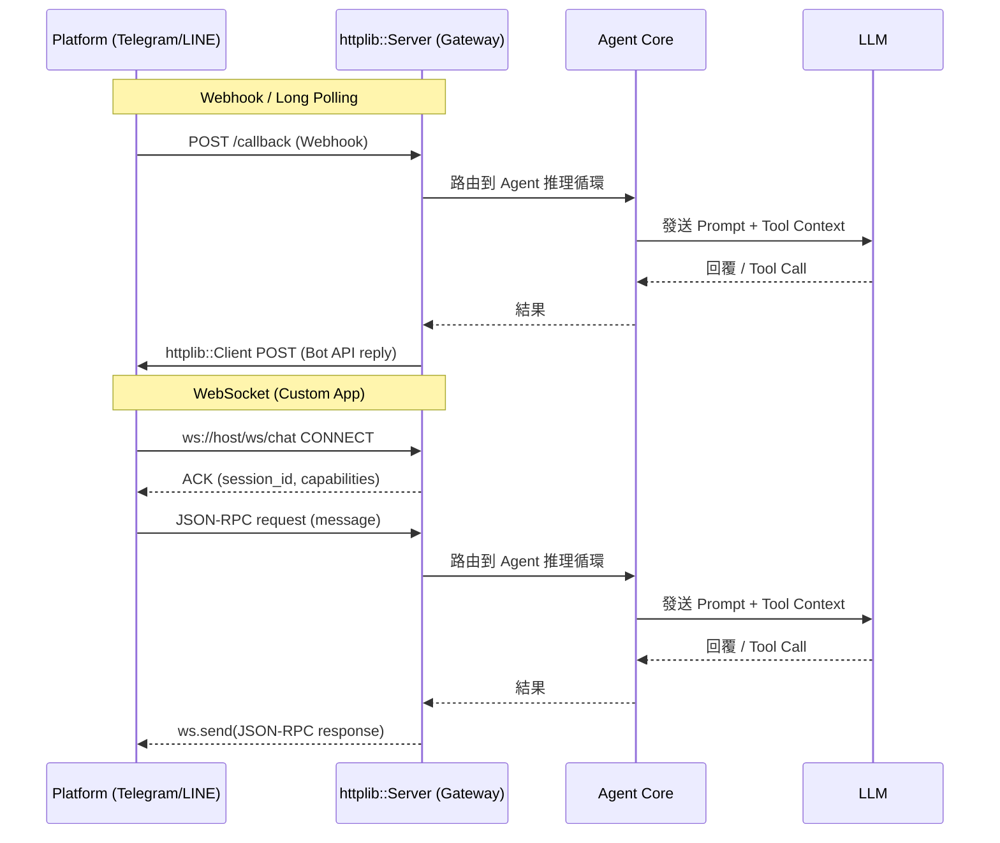
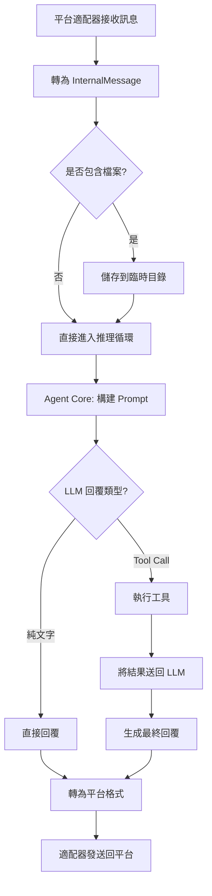

# Message App Protocol — Agent ↔ Chat Platform 通訊協議

> 定義 ZL Agent 與即時通訊平台（Telegram / LINE / WhatsApp 等）之間的溝通協議，讓 Agent 能作為聊天機器人接收訊息、執行工具、回覆使用者。
>
> **技術基礎：** 基於 [httplib.h](include/httplib.h) 實作 HTTP Server / WebSocket Server / SSE Client，零額外依賴。

---

## 1. 總覽

```
┌──────────────┐     Telegram Bot API      ┌──────────────┐
│   Telegram    │◄───── httplib::Client ───►│              │
│   LINE        │                           │  ZL Agent    │
│   WhatsApp    │◄───── httplib::Server ───►│  (Gateway)   │
│   Custom App  │◄───── WebSocket / SSE ───►│              │
└──────────────┘                           └──────┬───────┘
                                                  │
                                          ┌───────▼──────┐
                                          │  Tool Engine  │
                                          │  LLM Pipeline │
                                          └──────────────┘
```

**核心概念：** Agent 作為 Gateway，透過統一的內部協議接收來自各平台的訊息，經 LLM 推理後回覆。外部平台差異由適配層（Adapter）吸收。

### httplib.h 角色映射

| httplib.h 功能 | 用途 |
|---------------|------|
| `httplib::Server` + `.WebSocket()` | Agent 內建 WebSocket Server，供前端/第三方即時連線 |
| `httplib::Client` / `SSLClient` | 呼叫 Telegram Bot API、LINE Messaging API（外部 HTTP Client） |
| `httplib::sse::SSEClient` | SSE 串流回覆（Agent → 前端逐字輸出 LLM 結果） |
| `httplib::Server` + `.Post()` / `.Get()` | REST API 端點 + Webhook callback |

---

## 2. 傳輸層

### 2.1 通訊方式

| 模式 | httplib.h 實作 | 用途 |
|------|---------------|------|
| **WebSocket** | `httplib::Server::WebSocket()` + `httplib::WebSocket` | Agent 內建即時雙向通道 |
| **HTTP REST** | `httplib::Server::Post()` / `.Get()` | 同步請求/回調 |
| **Webhook** | `httplib::Server::Post("/callback")` | Telegram/LINE 推送事件 |
| **SSE** | `httplib::sse::SSEClient` + chunked provider | LLM 逐字串流回覆 |

### 2.2 WebSocket 端點

```
cpp
// Agent Gateway 啟動時註冊 WebSocket 路由
server.WebSocket("/ws/chat", ws_chat_handler);
server.WebSocket("/ws/admin", ws_admin_handler);
server.WebSocket("/ws/file", ws_file_handler);
```

### 2.3 httplib::Client 呼叫外部 API

```cpp
// Telegram Bot API — Long Polling
httplib::Client tg_client("https://api.telegram.org");
auto res = tg_client.Get(
    "/bot" + bot_token + "/getUpdates",
    { {"timeout", "30"} }
);

// LINE Messaging API — Webhook 驗證
httplib::Client line_client("https://api.line.me");
auto res = line_client.Post(
    "/v2/oauth/accessToken",
    body, "application/x-www-form-urlencoded"
);
```

### 2.4 連線流程



---

## 3. 訊息協議格式

### 3.1 封裝結構（JSON-RPC 2.0）

所有 WebSocket 訊息採用 **JSON-RPC 2.0** 格式：

```jsonc
// ── Request ──
{
    "jsonrpc": "2.0",
    "id": 1,                          // 請求 ID（用於配對 response）
    "method": "chat.send_message",     // 方法名稱
    "params": {                        // 參數物件
        "session_id": "sess_abc123",
        "content": "你好，幫我搜尋檔案"
    }
}

// ── Response ──
{
    "jsonrpc": "2.0",
    "id": 1,
    "result": {
        "status": "ok",
        "message_id": "msg_xyz789",
        "content": "已為你搜尋到以下檔案..."
    }
}

// ── Error Response ──
{
    "jsonrpc": "2.0",
    "id": 1,
    "error": {
        "code": -32600,
        "message": "Invalid Request"
    }
}

// ── Notification（無 id，不需回覆）──
{
    "jsonrpc": "2.0",
    "method": "chat.message_received",
    "params": { ... }
}
```

### 3.2 訊息類型定義

#### 文字訊息

```jsonc
// ── 發送文字 ──
{
    "id": 1,
    "method": "chat.send_message",
    "params": {
        "session_id": "sess_abc123",
        "type": "text",
        "content": "你好！"
    }
}

// ── 回覆文字 ──
{
    "id": 1,
    "result": {
        "message_id": "msg_001",
        "type": "text",
        "content": "你好！有什麼可以幫忙？"
    }
}
```

#### 檔案/媒體訊息

```jsonc
// ── 發送圖片 ──
{
    "id": 2,
    "method": "chat.send_message",
    "params": {
        "session_id": "sess_abc123",
        "type": "image",
        "content": null,
        "file_info": {
            "filename": "screenshot.png",
            "mime_type": "image/png",
            "size_bytes": 245760,
            "url": "https://example.com/img/screenshot.png"   // 或 base64 data URI
        }
    }
}

// ── 發送檔案 ──
{
    "id": 3,
    "method": "chat.send_message",
    "params": {
        "session_id": "sess_abc123",
        "type": "file",
        "content": null,
        "file_info": {
            "filename": "report.pdf",
            "mime_type": "application/pdf",
            "size_bytes": 1048576,
            "url": "https://example.com/files/report.pdf"
        }
    }
}

// ── 發送語音 ──
{
    "id": 4,
    "method": "chat.send_message",
    "params": {
        "session_id": "sess_abc123",
        "type": "audio",
        "content": null,
        "file_info": {
            "filename": "voice.ogg",
            "mime_type": "audio/ogg",
            "size_bytes": 51200,
            "duration_ms": 5000,
            "url": "https://example.com/audio/voice.ogg"
        }
    }
}

// ── 發送影片 ──
{
    "id": 5,
    "method": "chat.send_message",
    "params": {
        "session_id": "sess_abc123",
        "type": "video",
        "content": null,
        "file_info": {
            "filename": "demo.mp4",
            "mime_type": "video/mp4",
            "size_bytes": 5242880,
            "duration_ms": 30000,
            "url": "https://example.com/video/demo.mp4"
        }
    }
}
```

#### 富文字 / Markdown

```jsonc
{
    "id": 6,
    "method": "chat.send_message",
    "params": {
        "session_id": "sess_abc123",
        "type": "markdown",
        "content": "# 報告\n\n- **重點一**：完成\n- *重點二*：進行中"
    }
}
```

#### 回覆/引用訊息（Reply）

```jsonc
{
    "id": 7,
    "method": "chat.send_message",
    "params": {
        "session_id": "sess_abc123",
        "type": "text",
        "content": "這個檔案我找到了",
        "reply_to": "msg_001"           // 引用原始訊息 ID
    }
}
```

#### 已讀/輸入狀態通知

```jsonc
// ── 打字中通知（Notification，無 id）──
{
    "method": "chat.typing_status",
    "params": {
        "session_id": "sess_abc123",
        "is_typing": true
    }
}

// ── 已讀通知 ──
{
    "method": "chat.read_receipt",
    "params": {
        "message_ids": ["msg_001", "msg_002"]
    }
}
```

---

## 4. API 方法清單

### 4.1 Chat（聊天）

| Method | Direction | Description |
|--------|-----------|-------------|
| `chat.send_message` | Client → Agent | 發送訊息給 Agent |
| `chat.message_sent` | Agent → Client | Agent 回覆訊息通知 |
| `chat.typing_status` | Bidirectional | 打字中狀態 |
| `chat.read_receipt` | Client → Agent | 已讀回條 |
| `chat.edit_message` | Client → Agent | 編輯訊息（支援） |
| `chat.delete_message` | Client → Agent | 刪除訊息 |

### 4.2 Session（會話管理）

| Method | Direction | Description |
|--------|-----------|-------------|
| `session.create` | Client → Agent | 建立新會話 |
| `session.close` | Client → Agent | 關閉會話 |
| `session.list` | Client → Agent | 列出活躍會話 |
| `session.get_history` | Client → Agent | 取得聊天歷史 |

### 4.3 File（檔案傳輸）

| Method | Direction | Description |
|--------|-----------|-------------|
| `file.upload` | Client → Agent | 上傳檔案 |
| `file.download_url` | Agent → Client | 下載連結通知 |
| `file.progress` | Bidirectional | 傳輸進度 |

### 4.4 Admin（管理）

| Method | Direction | Description |
|--------|-----------|-------------|
| `admin.ping` | Bidirectional | 心跳檢測 |
| `admin.shutdown` | Client → Agent | 關閉服務 |
| `admin.restart` | Client → Agent | 重啟服務 |
| `admin.get_status` | Client → Agent | 取得系統狀態 |

### 4.5 Group（群組）

| Method | Direction | Description |
|--------|-----------|-------------|
| `group.create` | Client → Agent | 建立群組 |
| `group.add_member` | Client → Agent | 加入成員 |
| `group.remove_member` | Client → Agent | 移除成員 |
| `group.send_message` | Client → Agent | 發送群組訊息 |

---

## 5. 認證與安全

### 5.1 Token 認證

```
// WebSocket 連線時攜帶 Token
ws://<host>:<port>/ws/chat?token=<api_token>

// HTTP 請求時在 Header 中攜帶
Authorization: Bearer <api_token>
```

### 5.2 Token 類型

| Token Type | Scope | Lifetime |
|------------|-------|----------|
| `admin` | 全部權限 | 永久（可手動撤銷） |
| `chat` | 聊天 + 工具呼叫 | 可設定過期時間 |
| `readonly` | 僅讀取歷史 | 可設定過期時間 |

### 5.3 TLS / WSS

生產環境強制使用 **WSS**（WebSocket Secure），傳輸層加密。

### 5.4 Rate Limiting

```ini
[rate_limit]
enabled = true
requests_per_minute = 60          # 每分鐘最大請求數
burst_size = 10                   # 突發上限
ban_duration_seconds = 300        # 違規封禁時間（秒）
```

---

## 6. Agent 適配層設計

### 6.1 平台適配器介面

每個通訊平台實作一個 Adapter，將平台原生訊息轉為統一協議：

```cpp
// include/message_adapter.h

class IMessageAdapter {
public:
    virtual ~IMessageAdapter() = default;

    // 啟動適配器（連線到平台 API）
    virtual bool start(const Config& config) = 0;
    virtual void stop() = 0;

    // 接收來自平台的訊息 → 轉為內部格式
    using OnMessageCallback = std::function<void(const InternalMessage&)>;
    virtual void set_on_message(OnMessageCallback cb) = 0;

    // 發送訊息到平台（Agent 回覆）
    virtual bool send_message(const InternalMessage& msg) = 0;

    // 取得適配器名稱
    virtual std::string name() const = 0;

    // 是否支援檔案傳輸
    virtual bool supports_files() const = 0;

    // 是否支援群組
    virtual bool supports_groups() const = 0;
};
```

### 6.2 Telegram Adapter

```cpp
// src/telegram_adapter.cpp

class TelegramAdapter : public IMessageAdapter {
public:
    bool start(const Config& config) override;       // Bot Token + Webhook/Polling
    void stop() override;

private:
    std::string m_bot_token;
    long long m_chat_id;
    bool m_use_webhook = false;                       // webhook 或 long polling
    httplib::Server m_server;                         // webhook server
    std::thread m_polling_thread;                     // polling thread

    // Telegram Bot API → InternalMessage
    InternalMessage telegram_to_internal(const nlohmann::json& update);

    // InternalMessage → Telegram Bot API call
    bool send_via_api(const InternalMessage& msg);
};
```

### 6.3 LINE Adapter

```cpp
// src/line_adapter.cpp

class LineAdapter : public IMessageAdapter {
public:
    bool start(const Config& config) override;        // Channel Access Token + Webhook

private:
    std::string m_channel_access_token;
    httplib::Server m_webhook_server;                 // /callback endpoint

    InternalMessage line_to_internal(const nlohmann::json& event);
    bool send_via_api(const InternalMessage& msg);
};
```

### 6.4 適配器註冊

```cpp
// src/message_gateway.cpp

class MessageGateway {
public:
    // 註冊適配器
    void register_adapter(std::unique_ptr<IMessageAdapter> adapter);

    // 啟動所有適配器
    bool start_all();

    // Agent 回覆 → 路由到正確的適配器
    void route_reply(const InternalMessage& msg);

private:
    std::map<std::string, std::unique_ptr<IMessageAdapter>> m_adapters;
};
```

---

## 7. 內部訊息格式（InternalMessage）

所有平台適配器統一轉為此結構：

```cpp
// include/internal_message.h

enum class MessageType {
    Text,
    Image,
    Audio,
    Video,
    File,
    Markdown,
    Location,
    Sticker,
    System          // 系統通知（加入群組、改名等）
};

struct FileInfo {
    std::string filename;
    std::string mime_type;
    size_t      size_bytes = 0;
    std::string url;                    // 下載 URL 或 base64 data URI
    int         duration_ms = 0;        // audio/video 用
};

struct InternalMessage {
    std::string   message_id;           // 唯一 ID（UUID）
    std::string   session_id;           // 會話 ID
    std::string   sender_id;            // 發送者 ID
    std::string   platform;             // "telegram", "line", ...
    MessageType   type = MessageType::Text;
    std::string   content;              // 文字內容（type=Text/Markdown）
    FileInfo      file_info;            // 媒體/檔案資訊
    std::string   reply_to;             // 引用訊息 ID
    int64_t       timestamp_ms;         // 時間戳記（毫秒）

    // Agent 處理相關
    bool          is_from_agent = false;     // 是否為 Agent 回覆
    bool          needs_tool_call = false;   // 是否需要工具呼叫
};
```

---

## 8. Agent 推理整合

### 8.1 訊息處理流程



### 8.2 Tool Call 整合

Agent 在聊天情境下可呼叫現有工具：

```jsonc
// Agent 收到 "幫我搜尋 project 中的 error" → Tool Call
{
    "tool": "grep",
    "parameters": {
        "regex": "error",
        "include_pattern": "**/*.{cpp,h,py}"
    }
}

// 工具執行結果 → LLM 生成回覆 → 發送回聊天平台
```

### 8.3 httplib::Server 路由註冊範例

```cpp
// src/message_gateway.cpp — 使用 httplib::Server 註冊所有端點

class MessageGateway {
public:
    bool start(int port) {
        // ── REST API ──
        server_.Post("/api/v1/chat/send", [this](const auto& req, auto& res) {
            auto msg = parse_request(req);
            auto reply = agent_core_->process(msg);
            res.set_content(reply.to_json(), "application/json");
        });

        server_.Get("/api/v1/chat/history", [this](const auto& req, auto& res) {
            auto session_id = req.get_param_value("session_id");
            auto history = memory_->get_history(session_id);
            res.set_content(history.to_json(), "application/json");
        });

        server_.Get("/api/v1/status", [](const auto& /*req*/, auto& res) {
            res.set_content(R"({"status":"ok","uptime":42})",
                           "application/json");
        });

        // ── Webhook (Telegram / LINE) ──
        server_.Post("/callback", [this](const auto& req, auto& res) {
            auto platform = detect_platform(req);
            if (platform == "telegram") {
                handle_telegram_update(req.body, res);
            } else if (platform == "line") {
                handle_line_event(req.body, res);
            }
        });

        // ── WebSocket ──
        server_.WebSocket("/ws/chat", [this](const auto& req, auto& ws) {
            on_ws_chat_connect(ws);
        });

        return server_.listen("0.0.0.0", port);
    }

private:
    httplib::Server server_;
};
```

### 8.4 WebSocket 訊息處理範例

```cpp
// src/message_gateway.cpp — WebSocket handler

void MessageGateway::on_ws_chat_connect(httplib::WebSocket& ws) {
    // ── 接收訊息 ──
    auto on_read = [&ws, this](const char* data, size_t len, int /*opcode*/) {
        std::string json(data, len);
        auto msg = parse_json_rpc(json);          // JSON-RPC → InternalMessage
        auto reply = agent_core_->process(msg);   // Agent 推理
        ws.send(reply.to_json().c_str(),
                reply.to_json().size());           // 回覆
    };

    // ── Ping/Pong（httplib 內建心跳）──
    auto on_close = [this](int /*code*/, const std::string& /*reason*/) {
        cleanup_session();
    };

    ws.set_read_handler(on_read);
    ws.set_close_handler(on_close);
}
```

### 8.5 SSE 串流回覆範例

```cpp
// src/message_gateway.cpp — LLM 逐字輸出到前端

server_.Post("/api/v1/chat/send/stream",
    [this](const auto& req, auto& res) {
        auto msg = parse_request(req);

        // httplib chunked content provider → SSE
        res.set_chunked_content_provider(
            "text/event-stream",
            [&msg, this](size_t /*offset*/, DataSink& sink) {
                // 模擬 LLM 逐字輸出
                auto chunks = agent_core_->stream_process(msg);
                for (const auto& chunk : chunks) {
                    std::string sse_line = "data: {\"text\": \""
                        + escape_json(chunk) + "\"}\n\n";
                    sink.os << sse_line;
                }
                // 結束標記
                sink.os << "event: done\ndata: {\"status\":\"ok\"}\n\n";
                return true;
            });
    });
```

### 8.6 Telegram Long Polling 範例

```cpp
// src/telegram_adapter.cpp — 使用 httplib::Client 呼叫 Bot API

class TelegramAdapter : public IMessageAdapter {
public:
    bool start(const Config& config) override {
        m_bot_token = config.get("message.telegram.bot_token", "");

        if (config.get_bool("message.telegram.use_webhook", false)) {
            // Webhook 模式：httplib::Server 接收推送
            return true;
        }

        // Long Polling 模式：定期呼叫 getUpdates
        m_polling_thread = std::thread([this]() {
            httplib::Client client("https://api.telegram.org");
            while (m_running) {
                auto path = "/bot" + m_bot_token + "/getUpdates";
                auto res = client.Get(path.c_str(),
                    httplib::ParamsWithTraits{{"timeout", "30"}});

                if (!res || res->status != 200) {
                    std::this_thread::sleep_for(std::chrono::seconds(5));
                    continue;
                }

                auto updates = parse_telegram_updates(res->body);
                for (const auto& update : updates) {
                    if (update.has_message()) {
                        auto internal_msg = telegram_to_internal(update);
                        m_on_message_callback(internal_msg);
                    }
                }
            }
        });

        return true;
    }

private:
    httplib::Client m_tg_client;  // Telegram Bot API client
    std::string     m_bot_token;
    bool            m_running = false;
    std::thread     m_polling_thread;
};
```

### 8.7 多輪對話記憶

利用現有的 `memory.h` 管理聊天上下文：

```ini
[memory]
max_messages = 50              # 每會話保留的訊息數
long_term_enabled = true       # 跨會話記憶
store_dir = .zlagent_memory    # 持久化路徑
```

---

## 9. 配置檔（INI）

在 `zlagent.ini` 新增 `[message]` 區段：

```ini
[message]
enabled = true                              # 啟用通訊適配器
adapter = telegram                          # 適配器名稱: telegram, line, custom
max_file_size_mb = 50                       # 最大檔案大小（MB）
auto_reply_delay_ms = 100                   # 自動回覆延遲（模擬打字感）

[message.telegram]
bot_token = YOUR_BOT_TOKEN                  # Telegram Bot Token
use_webhook = false                         # true=Webhook, false=Long Polling
webhook_url = https://your-domain.com/callback
allowed_chat_ids =                          # 空=允許所有，否則逗號分隔

[message.line]
channel_access_token = YOUR_LINE_TOKEN      # LINE Channel Access Token
webhook_path = /callback                    # Webhook 路徑

[message.security]
require_tls = true                          # 強制 TLS
rate_limit_enabled = true                   # 啟用速率限制
requests_per_minute = 60                    # 每分鐘最大請求數
api_token =                                 # API Token（空=不驗證）

[message.file]
upload_dir = /tmp/zlagent_uploads           # 上傳暫存目錄
cleanup_after_hours = 24                    # 清理時效（小時）
allowed_mime_types =                        # 空=允許所有，否則逗號分隔
```

---

## 10. HTTP REST API（同步模式）

除了 WebSocket，也提供 REST API 供簡單整合：

### 10.1 端點清單

| Method | Endpoint | Description |
|--------|----------|-------------|
| `POST` | `/api/v1/chat/send` | 發送訊息 |
| `GET`  | `/api/v1/chat/history?session_id=xxx` | 取得聊天歷史 |
| `POST` | `/api/v1/file/upload` | 上傳檔案 |
| `GET`  | `/api/v1/status` | 系統狀態 |

### 10.2 發送訊息

```bash
curl -X POST http://localhost:8080/api/v1/chat/send \
  -H "Authorization: Bearer <token>" \
  -H "Content-Type: application/json" \
  -d '{
    "session_id": "sess_abc123",
    "type": "text",
    "content": "你好，幫我搜尋檔案"
  }'
```

**回覆：**

```jsonc
{
    "status": "ok",
    "message_id": "msg_xyz789",
    "type": "text",
    "content": "已為你搜尋到以下檔案：\n1. src/main.cpp\n2. include/agent.h"
}
```

### 10.3 流式回覆（SSE）

```bash
curl -N http://localhost:8080/api/v1/chat/send/stream \
  -H "Authorization: Bearer <token>" \
  -d '{"session_id": "sess_abc123", "content": "你好"}'
```

**回覆（Server-Sent Events）：**

```
event: chunk
data: {"text": "你"}

event: chunk
data: {"text": "好！"}

event: done
data: {"message_id": "msg_001", "status": "ok"}
```

---

## 11. 群組聊天支援

### 11.1 群組訊息格式

```jsonc
{
    "id": 8,
    "method": "group.send_message",
    "params": {
        "group_id": "grp_001",
        "type": "text",
        "content": "大家好！"
    }
}
```

### 11.2 Agent 在群組中的行為

| 情境 | 行為 |
|------|------|
| `@Agent` 提及 | 回覆該使用者 |
| 直接訊息（私聊） | 正常回覆 |
| 群組中無人提及 | 可設定為監聽模式或忽略 |

### 11.3 群組管理

```ini
[message.group]
listen_mode = mention_only          # all, mention_only, off
mention_keywords = @Agent,@助手     # 觸發回覆的關鍵詞
max_group_size = 200                # 最大群組人數
```

---

## 12. 錯誤碼定義

| Code | Name | Description |
|------|------|-------------|
| `-32700` | Parse Error | JSON 解析失敗 |
| `-32600` | Invalid Request | 請求格式無效 |
| `-32601` | Method Not Found | 方法不存在 |
| `-32602` | Invalid Params | 參數錯誤 |
| `1001` | Auth Failed | 認證失敗 |
| `1002` | Rate Limited | 超過速率限制 |
| `1003` | Session Not Found | 會話不存在 |
| `1004` | File Too Large | 檔案過大 |
| `1005` | Unsupported Type | 不支援的訊息類型 |
| `2001` | LLM Error | LLM 推理失敗 |
| `2002` | Tool Execution Failed | 工具執行失敗 |

---

## 13. 專案結構規劃

```
zlagent/
├── include/
│   ├── message_adapter.h       # IMessageAdapter 介面
│   ├── internal_message.h      # InternalMessage 定義
│   └── message_gateway.h       # MessageGateway（適配器管理）
├── src/
│   ├── telegram_adapter.cpp    # Telegram Bot API 實作
│   ├── line_adapter.cpp        # LINE Messaging API 實作
│   └── message_gateway.cpp     # Gateway 路由邏輯
├── tools/
│   └── chat_tool.cpp           # 聊天工具（Agent Tool Registry）
├── CMakeLists.txt              # 新增適配器編譯選項
└── zlagent.ini                 # 新增 [message] 配置區段
```

---

## 14. 開發路線圖

| Phase | 內容 | 優先級 |
|-------|------|--------|
| **P0** | JSON-RPC 協議定義 + InternalMessage | 🔴 高 |
| **P0** | Telegram Adapter（Long Polling） | 🔴 高 |
| **P1** | HTTP REST API | 🟡 中 |
| **P1** | LINE Adapter | 🟡 中 |
| **P2** | WebSocket Server | 🟢 低 |
| **P2** | 檔案傳輸支援 | 🟢 低 |
| **P3** | 群組聊天 + @提及 | 🔵 延後 |
| **P3** | SSE 流式回覆 | 🔵 延後 |

---

## 15. 與現有系統整合點

| 現有模組 | 整合方式 |
|----------|----------|
| `agent.h` / `agent.cpp` | InternalMessage → Agent 推理循環輸入 |
| `tool.h` / ToolRegistry | Agent 在聊天中呼叫工具（grep, read_file 等） |
| `memory.h` | 每會話獨立記憶，跨平台共享 |
| `config.h` | `[message]` INI 區段解析 |
| `safety_guard.h` | 聊天輸入過濾 + 危險操作確認 |
| `task_planner.h` | 複雜請求自動拆解為子任務 |
| `self_reflector.h` | Agent 回覆品質檢查 |
